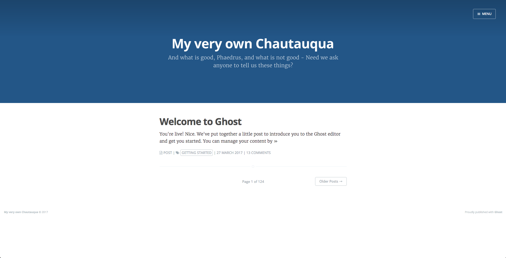
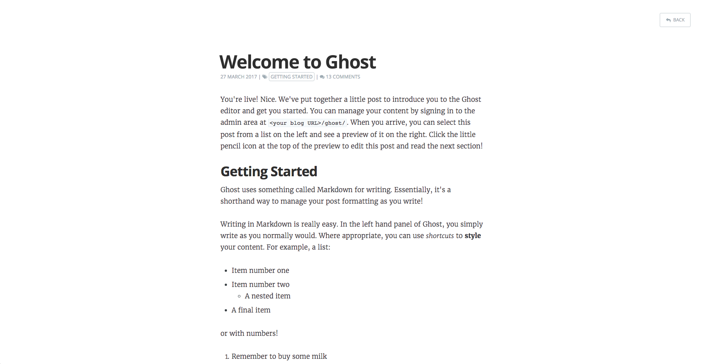
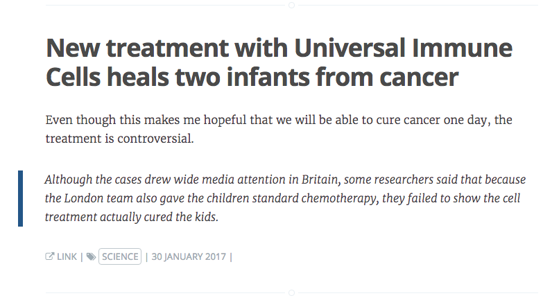

# Lazo - Ghost theme

Lazo is a theme based on [Casper](https://github.com/TryGhost/casper), [Ghost's](https://ghost.org) default personal blogging theme.

I like Casper a lot, especially the post/page view. And since it is much effort to design a new theme, and I am not so good at design (esp. fonts and colors), I decided to use as much of the original Casper as possible. 

## Main branch

The main branch contains the following changes:
- Include [GhostHunter](https://github.com/jamalneufeld/ghostHunter) search engine
- Include [prism.js](http://prismjs.com/) for syntax highlightning
- Change menu font to non-serif
- Different tag formatting on index and single post view
- Replaced menu button with back button on page and post sites
- Replaced author info and link with post type on index page
- Support now five different post types:
  - post (regular blog post)
  - page (regular page type)
  - quote (a quote)
  - link (post a link with a comment and maybe a quote)
  - post-it (short blog post, micro blogging)

### Post types

The extra post types are assigned to certain tags that need to be present within Ghost. For the extra post types to work, you need to assign one of the following tags to the post (together with all other tags you want to apply).

| Post Type | Tag     |
| --------- | ------- |
| Quote     | quote   |
| Link      | link    |
| Post-It   | post-it |

The post types for post, page, quote and post-it are more or less the same. On the index page, during the post loop, they get assigned a different icons and the post type is displayed. It is a basis for future enhancements, to be able to treat each post type differently.

#### Link

To have a properly formatted link-type post it needs to be formatted in the following way:

    <Link>
    <Comment>
    <Quote> [Optional]
    
The quote is optional. The post title will not be displayed, instead the first link in the content will be formatted as a title in the index view. The link to the post can be found when clicked on the post-type in the index view.

## Home-Button branch

In addition to the changes from the main branch, this branch also includes a home button on the upper left side, to get back quickly to the blog's index.